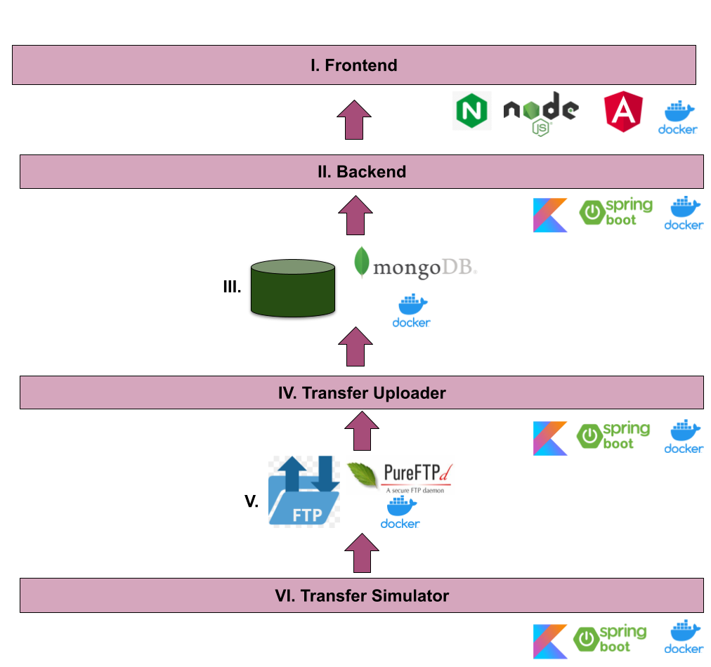

# Ninety-nine Code Challenge

## Guide to testing this submission

External dependencies:

 * git
 * docker
 * docker-compose

Download the project directly through git clone and use docker compose.

 ```bash
 git clone https://github.com/JTejedor/ninety-nine.git
 cd ninety-nine
 docker-compose -f ninety-nine.yml up
  ```
In your favorite browser, navigate to this url:

http://localhost:4200/

Clarification Note: Due to the transfer uploader component (component to deploy transfers from FTP server to Mongo every 5 minutes) has an external dependency related to monetary exchange, the initial deploy is a little bit slow, so I recommend wait 30 seconds or so, to query from the frontend. Anyway, press F5 to refresh until data is uploaded properly (sorry for this inconvenience).

And to ending the evaluation, just press CTRL+C and run this:

```bash
docker-compose -f ninety-nine.yml down
 ```

Enjoy ;-)

## Overview

Ninety nine challenge has been a very interesting project to work with. Each component has been containerized and to gather all components, the technology of docker compose has been used.

As the main language of the backend and the following lower layers has been kotlin, using jvm in its version 11. It was a way to understand the technology used in Ninety Nine. I have spent more time than I thought at first, but I also think that I have been able to learn in order to participate as fast as possible in ninety nine (this has been a risky bet).

As a build automation tool, I choose Gradle 6.6, I am not sure if ninenty-nine is using it right now, but I think is very intuitive, simple and with little learning curve.

As frontend technology, Angular 9 is used because I have enough experience using this framework, to create quickly a proper and interesting view of the whole project.

I choose git as version control system. Absolutely.

I have work with IntelliJ as IDE for Kotlin and Visual Studio Code for Angular.
Each Kotlin project is ready to be opened using Intellij, as well the angular project is ready to be opened with Visual Studio Code.

I try to follow gitflow approach with github pull request to merge over develop and master (with just one reviewer, me). Creating branches for each new feature or to fix some problems, as gitflow suggested. I have emphasized my effort in the creation of the commit messages

## Design



## Implementation

Each component has been dockerized and updated as an image to a public repository called jtejedor/ninety-nine in docker hub. In each section, the component will be explained deeply and will be described its container

### I. Frontend

As I explain above in overview, the main framework to create this component has been Angular 9, in essence, this is it because I feel comfortable using it and there are plenty ready-to-use components based on this technology.

The application has been separated into different views to facilitate decoupling of all views.

In a nutshell, the parts of this frontend was:

  * Charts to visualize properly how many transfers are received based on a certain time unit (day, time, year) in different ranges of time
  * Custom component to visualize the best month hits in different ranges of time. To show the month with more received transfers and the month with the largest amount.
  * A table to view the last transfers related to certain IBAN (the IBANs are collected asking directly to backend too).
  * A final chart to view as pie chart how many currencies are. This component request for:
     - The total of currencies to create random colors used in the pie slices
     - The number of transfer of each currency to create the pie itself.

The created docker container to host this component is based on node-alpine to build properly the application and a raw nginx-alpine without any additional configuration to deploy. It has no parameter and the open port is 4200

### II. Backend

  This component is created Kotlin 1.3.74 (not 1.4 recently updated - because Kotest has a problem calling certain component inside Kotlin that is not longer in use) and as framework, Springboot was chosen because I have a little bit experience using it. Anyway, it is a very complete framework, but, in my humble opinion, I think it has soooo many layers of abstraction.

  In this components, some webflux reactive characteristics are used, such as reactive mongo template. But it is not a fully Springboot Reactive REST controller.
  I could part this element in several docker containers but I think, this could be a little bit overkill, so I decline my first impulse (because I think this submission is already a bit overkill by itself).

  This component has several endpoints to get all data related with this challenge, even some more.

  The structure of of each component with all related endpoints is, as Spring suggests, a controller with the endpoints, a service to provide the logical management (if any) and the DAO to get the data properly with the former query or aggregation operation.

  The created docker container is based in openjdk12-alpine and a jar created by gradle. The deploy in respository is automated (at project level).

### III. MongoDB

  The database is a mandatory request for this challenge, it is MongoDB, a NOSQL Database, I choose the last edition as image to deploy in docker-compose.
  It has no sharding, even if I know how to perform, I think ninety nine is using Atlas, so, I think it is not needed.

  To finish this section, I just comment that the collection "transfers" has several indexes to improve the queries using decoration capacity of spring in the next component.

  As this container is linked directly with another related components (with link directive and share the same docker net), I prefer not expose any port.

### IV. Transfer uploader

  This component takes advantage of Springboot's ability to perform periodic tasks. So each 5 minutes this component queries for the latest files to upload new data in a FTP Server. This component also store in MongoDB some interesting data related with the success rate of each file and the global performance. Due to time, I have not been able to propagate this data as I initially thought to frontend.

  Anyway, this component queries to mongodb wich files are already parsed, tries to parse any line of each transfer, add in transfers collections and it finalizes writing meta data related with this file in mongodb.

  This component considers all the assumptions exposed in the challenge, badly formed information where any field can be incomplete, contains empty lines or with just noise. The amount related with the currency could be in third o five position, so this component also takes into account and explores for both possibilities.

  The timestamp of each transfer is the original name of the file reformatted to transform in LocalDateTime.

  Instead of download the whole file, and process after, the file is downloader line per line using streams to avoid meaningless memory use.

  Finally, to maintain consistency in the sum of transfer amounts, an additional field is created to store the conversion to euros of that amount. Otherwise, it was too expensive to convert from a mongo query or meaningless amounts would be added. As consequence, an external dependency, to perform properly the exchange, is added, [JSR 354](https://jcp.org/en/jsr/detail?id=354).

### V. FTP server

  This is another request for this challenge, create a FTP server in your machine or anyway to upload files with the required characteristics. The selected FTP Server was an image of [pure ftpd server](https://www.pureftpd.org/project/pure-ftpd/) with capacity for 5 simultaneous clients and a single registered user.

  I prefer left a persistent volume in /tmp/ftp-data to facilitate consecutive tests and to have enough data. its deletion is recommended after evaluate this submission.

  Update note: To ensure that the system appears fully operational at first, I have uploaded some initial data to the FTP server image, so that the frontend already displays existing data, after mongo uploader starts and processes this first wave. It is in github, if you would like to see some results of FTP Uploader.

### VI. File FTP uploader

  This initial component was implemented to create random files with configurable failure rates. This component create a file with a transfer per line.

  This is probably the least important component, but it has been a lot of fun to create a consistent and random process that maintains acceptable success rates.

  To avoid large memory loads, a file is created and then uploaded to the server, instead of creating everything in memory.

  This component creates up to 20 files per month (it is a random number between 1 to 20), during the last 5 years, starting from the current month. Every ten minutes. It is a periodic task too.

  Some aspects to consider in the random creation:

  * For each random NIF (I consider a person) 4 random IBAN are created and associate to its NIF in the initialization phase of this component. So, in this way, the IBAN will be repeated, such as its related NIF to create each line-transfer.
  * The number of people is configurable too.
  * There is a possibility to fail for each part of the transfer-line (configurable).
  * There is a possibility to fail for each transfer (configurable also).
  * The amount related with the transfer change of position randomly third or five position (configurable). And it starts in 10.00
  * The currencies are also configurable by environment variable.

 To know which parameter are involved in the random criteria, see ninenity-nine.yml file
 Finally, this component is prepared to create large files, for this, it is recommended to uncomment the environment variable called JAVA_OPTS, in order to increase the JVM memory of the container to allow it to be feasible


## Conclusions

* A very good idea would be automatize the entire product over a new release (a tag in github over master branch) to autodeploy in docker hub a new image using CircleCI or Travis through "gradlelizing" the whole project, i.e., using Gradle as unique project manager to gather the global configuration of all components.

* I would perform more unit test to ensure a better fulfillment, but due to time, I have left only a symbolic record to ensure I could perform test and I understand the full software life cycle.

* I spend more than usual because I use technologies that I am not familiar with, such us Gradle (I have used Maven and more recently I have used C++ Conan and CMake).

* There is another reason for my delay, this is a very complete submission, which seeks to surprise for its good quality, but I do not know if I will achieve, because I have also had to use tools that I am not used to and I have exceeded the submission time. Or even my perception, as submitter is wrong.
